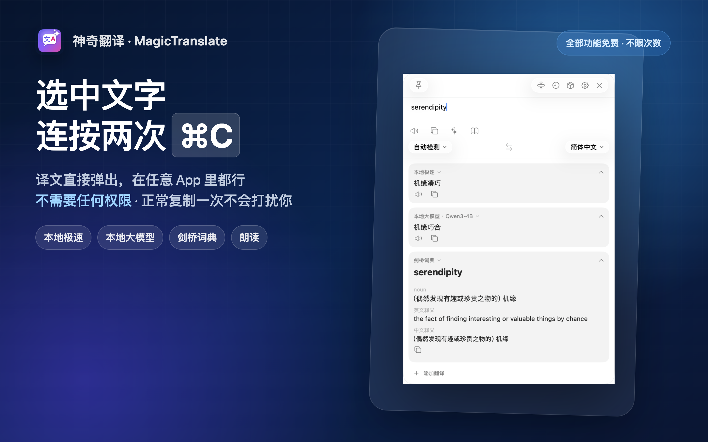
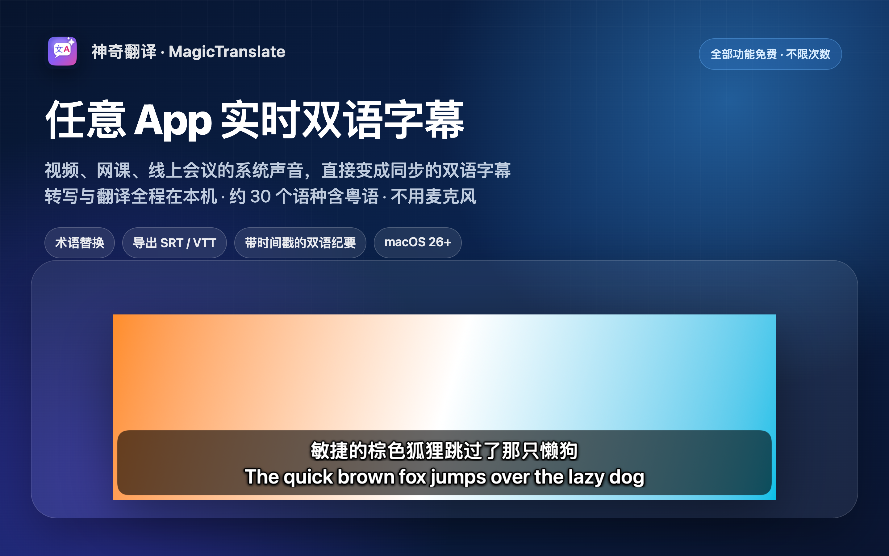
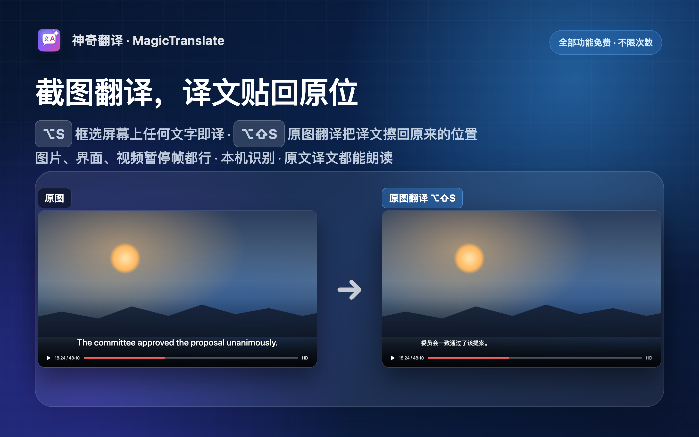

# 神奇翻译 · MagicTranslate

> 免费、不要权限的 Mac 翻译工具：选中文字连按两次 ⌘C 就出译文；给任意 App 的视频、网课、会议加实时双语字幕；本地大模型一键下载，断网也能用。
>
> A free Mac translator that needs no permissions: select text, press ⌘C twice. Live bilingual captions for any app, local LLMs in one click, everything on-device. [English below ↓](#english)

本仓库只提供使用说明、常见问题与开放格式的资产（术语包、快捷指令样例）。App 本体请从 Mac App Store 安装；源代码不公开。

## 三个动作，现在就能用

| | 怎么做 | 说明 |
|---|---|---|
| **划词翻译** | 在任意 App 选中文字，快速连按两次 ⌘C | 译文直接弹出。默认不需要任何系统权限；想"选中后直接按 ⌥D"，到 设置 → 隐私 开启「自动取词」（需辅助功能授权） |
| **截图翻译** | ⌥S 框选屏幕上任何文字 | 图片、视频画面、扫描件都行，本机识别；⌥⇧S 原图翻译把译文贴回原来的位置 |
| **输入翻译** | ⌥A 打开主窗，边打边译 | 多引擎并排对照，单词自动附词典释义 |

## 三件别家少见的事

- **任意 App 实时双语字幕**（macOS 26+）：Mac 上正在播放的声音（视频、网课、线上会议）直接变成同步的双语字幕。转写与翻译全程在本机，音频不上传，不使用麦克风。约 30 个语种含粤语；术语替换；结束后导出 SRT / VTT 或带时间戳的双语纪要。
- **本地大模型开箱即用**：内置模型市场按内存推荐 Qwen3 的 1.7B / 4B / 8B 三档，一键下载（国内走 ModelScope 源、多线程分段、断点续传），不需要 API Key。断网也能翻译、润色、总结；空闲 15 分钟自动释放内存。
- **查过的词不白查**：词典卡 → 生词本 → 到期复习 → 导出 Anki；术语库、翻译记忆、翻译档案可按 App 自动绑定；所有资产都是开放格式。

## 还有这些

对照阅读（PDF / EPUB / SRT / 网页分段双语、改译回写、双语导出）· 多引擎对照 · ⌘K AI 动作（润色 / 总结 / 纠错 / 解释代码，自定义提示词）· 静默翻译与静默 OCR 直进剪贴板 · 结构化 OCR（多栏阅读序、表格转 Markdown，macOS 26+）· 快捷指令 / URL Scheme / PopClip · 历史与收藏 · 中英文界面

## 隐私与权限

- 默认本地：翻译、OCR、字幕转写、本地大模型都在你的 Mac 上完成；云端引擎全部是你自己的 Key，默认关闭、不中转。
- 可验证：隐私模式（⌃⌥P）一键停用所有联网并显示拦截次数。
- 权限只在用到时请求：截图翻译 → 屏幕录制；实时字幕 → 系统音频录制（个别环境回退为屏幕录制通道），只取系统声音；「自动取词」可选、默认关闭，开启后只在按下快捷键的瞬间读取当前选中的文本。

## 系统要求

macOS 15 及以上；本地大模型需 Apple 芯片（M1 及之后）；实时字幕需 macOS 26 及以上。

## 常见问题

**实时字幕为什么要 macOS 26？** 本机语音转写依赖 macOS 26 引入的系统能力；macOS 15 上其他功能不受影响。

**本地模型下载慢？** 设置 → 服务 → 「国内镜像下载」保持开启（默认按网络自动判断）：会依次尝试 ModelScope、hf-mirror、Hugging Face，并对大文件做 4 线程分段下载与断点续传。

**选中文字按 ⌥D 没反应？** 默认不取词，改为连按两次 ⌘C，或复制后按 ⌥D；想要"选中后直接翻"，到 设置 → 隐私 开启「自动取词」并授权辅助功能。

**取到的是很久以前复制的内容？** 不会：剪贴板兜底只认最近一次复制。

**云端引擎在哪？** 设置 → 服务 里填你自己的 Key 才会出现；默认关闭。

## 反馈

- 使用说明与更新日志：https://fanyi.shujuf.com/guide.html · https://fanyi.shujuf.com/changelog.html
- 问题反馈：本仓库 Issues，或 https://fanyi.shujuf.com/support.html
- 菜单栏「导出诊断信息…」会在本机生成一份诊断文件（不上传），附在反馈里定位更快。

---

## English

**MagicTranslate** is a menu bar translator for Mac. Every feature is free with no limits.

- **Select, then translate**: select text in any app and press ⌘C twice — the translation pops up, no permissions needed. Prefer select-then-⌥D? Turn on "Automatic selection capture" in Settings › Privacy (Accessibility permission).
- **Screenshot translation** (⌥S): drag over any on-screen text; **in-image translation** (⌥⇧S) pastes the translation back where the original was.
- **Live bilingual captions** for any app (macOS 26+): audio playing on your Mac becomes synchronized bilingual captions, transcribed and translated on-device; export SRT / VTT or timestamped bilingual notes. Never uses the microphone.
- **Local LLMs in one click**: the built-in model market recommends a Qwen3 model for your RAM (1.7B / 4B / 8B) and downloads it — no API key, works offline.
- Bilingual reading (PDF / EPUB / SRT / web), engine comparison, ⌘K AI actions, dictionary → vocabulary → spaced review → Anki, glossaries and translation memory, Shortcuts / URL scheme / PopClip.

Requirements: macOS 15 or later; Apple silicon for local LLMs; macOS 26 or later for Live Captions.

Download: [Mac App Store](https://apps.apple.com/us/app/id6790817301) · Guide: https://en.fanyi.shujuf.com/guide.html · Support: https://en.fanyi.shujuf.com/support.html

This repository hosts documentation and open-format assets only; the app is closed source.
